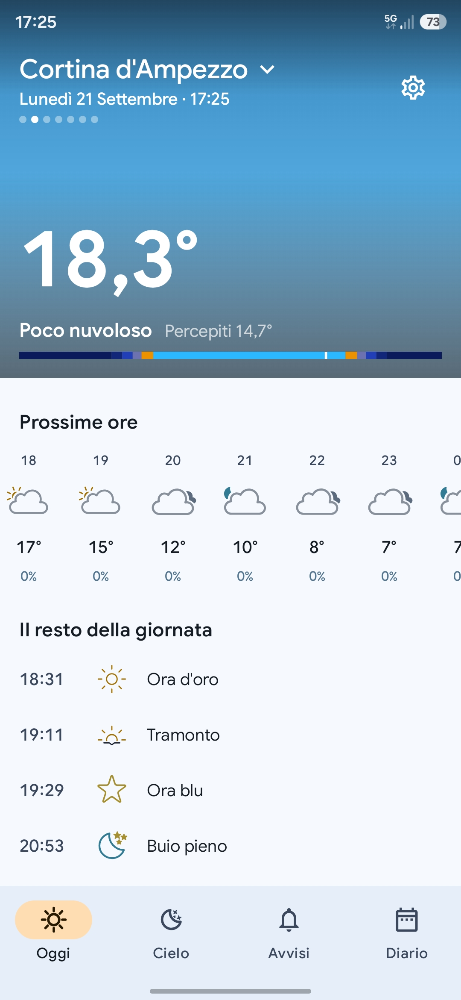
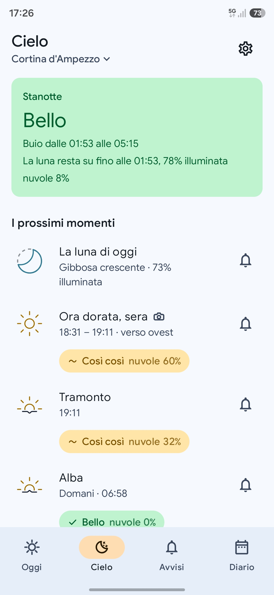
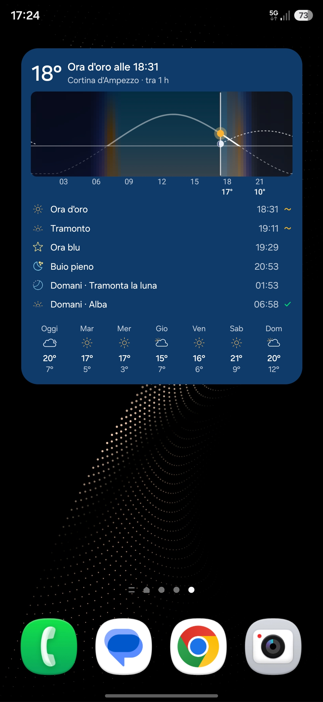
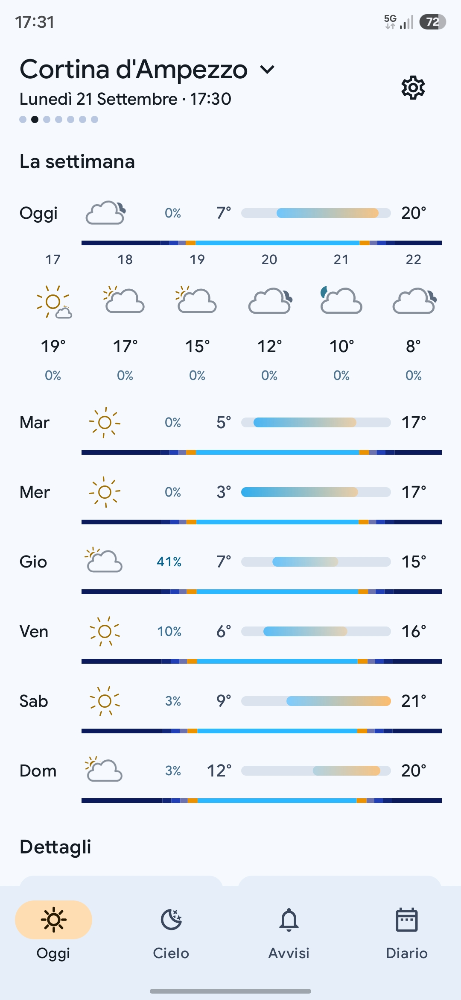
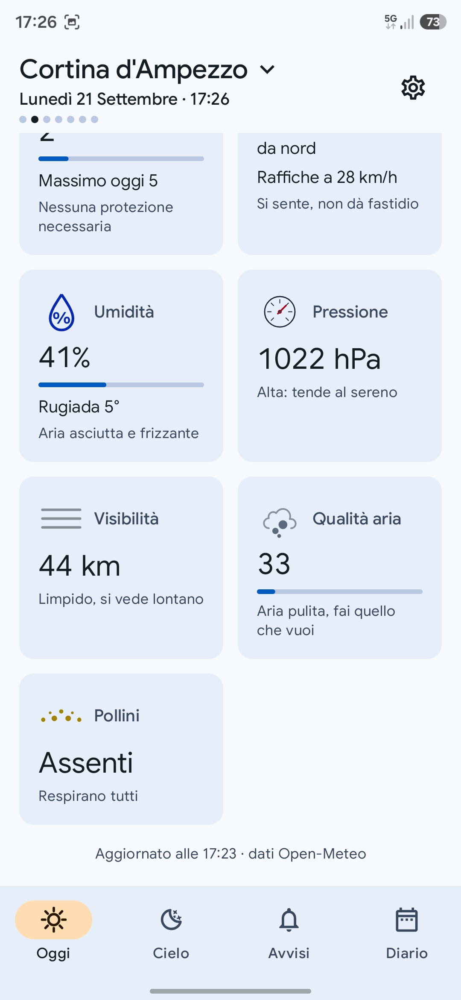
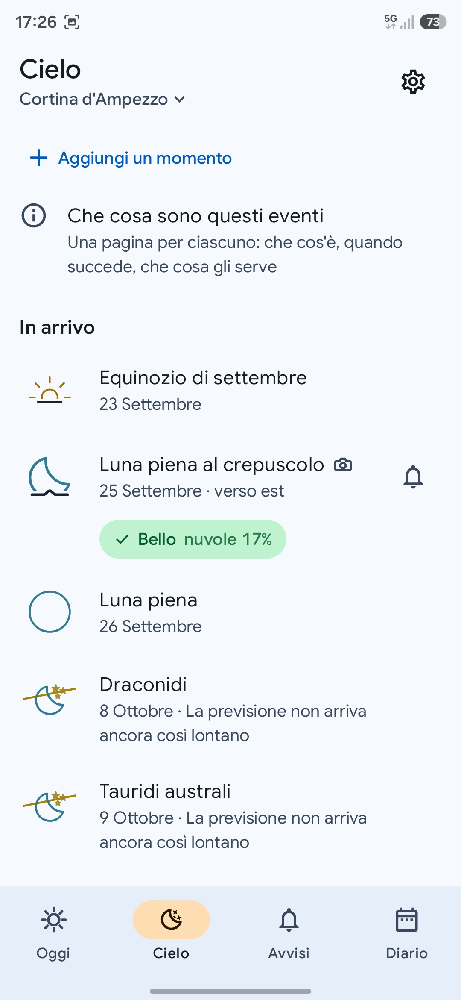
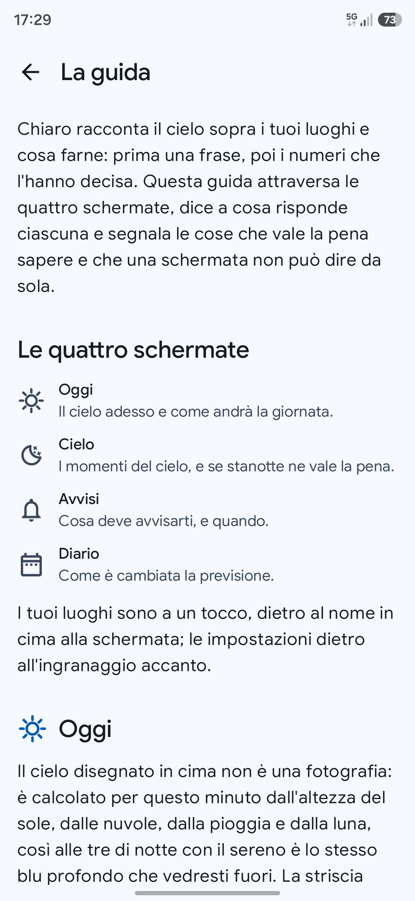
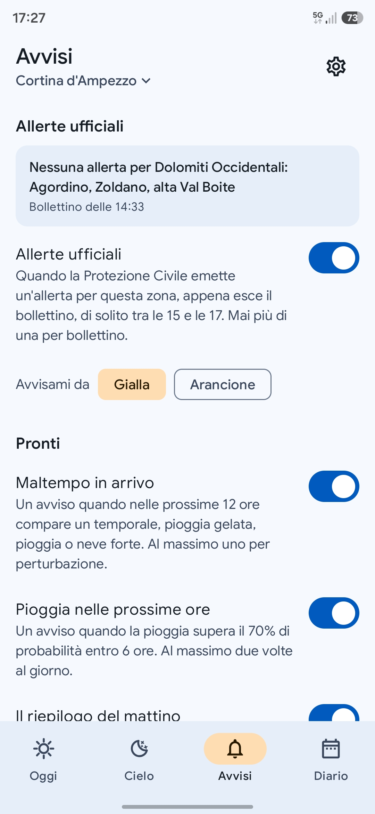
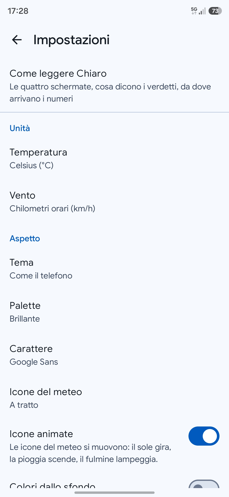
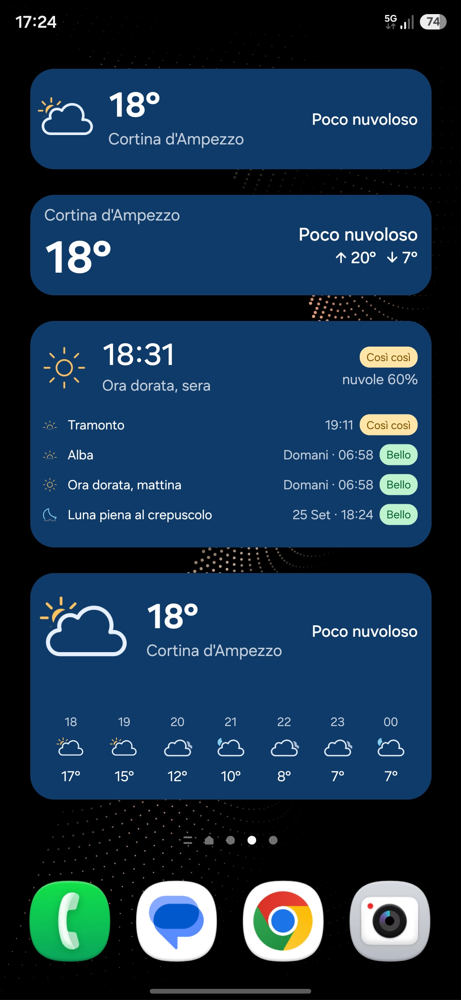

<div align="center">

# 🌤️ Chiaro

**Weather that tells you whether it is worth going out, and when.**

An Android weather app with a planner for the sky attached.
Free, no account, no ads, no tracking, no API key.


<table>
<tr>
<td width="33%"></td>
<td width="33%"></td>
<td width="33%"></td>
</tr>
<tr>
<td align="center"><sub><b>Today</b>: the sky, then the numbers</sub></td>
<td align="center"><sub><b>Sky</b>: tonight, and what is coming</sub></td>
<td align="center"><sub><b>The day's arc</b>, on the home screen</sub></td>
</tr>
</table>

</div>

## What Chiaro is

Chiaro answers the question people actually have: is it worth going outside, and when. It
opens on a computed sky and one sentence ("Umbrella around 17:00, clearing after 19:00"),
with the numbers underneath for whoever wants them, and every number carries the line that
says what to do with it. UV 8 is "burns in about 15 minutes, cover up", not an 8.

Around the forecast sits the rest of the app, which is where most of the work went.
**The sky has an agenda**: sunrise, the golden hour, the blue hour, the genuinely dark
window, the moon, the meteor peaks, each with the time it happens and whether the sky will
let you see it, computed from the same cloud forecast the app already downloaded. **It
remembers the forecast**: Saturday used to be 70% rain and is now 30%, and the movement is
often more useful than either number on its own. **You write the alerts**: start from an
idea ("tell me when I can ride") or build one out of real variables, and get told the
thing you actually care about. **The official bulletin is read here too**: in Italy the
Protezione Civile's criticality levels, located by where a place is rather than by how its
name is spelled, and shown next to the forecast they concern.

It works offline with the last data it managed to fetch, and it says how old that data is
instead of pretending. Nothing on the screen is there because a layout needed filling.

## Screenshots

Italian, on a phone, with real data over Cortina d'Ampezzo. The app ships in Italian and
English through the system per-app language picker.

**Today**, one vertical scroll that starts with the sky:

<table>
<tr>
<td width="33%"></td>
<td width="33%"></td>
<td width="33%"></td>
</tr>
<tr>
<td align="center"><sub>The computed sky, the next hours, the rest of the day</sub></td>
<td align="center"><sub>The week on one temperature scale, with each day's light</sub></td>
<td align="center"><sub>Every number carries its consequence, never a bare value</sub></td>
</tr>
</table>

**Sky**, the agenda of the sun and the sky with a verdict on each moment:

<table>
<tr>
<td width="33%"></td>
<td width="33%"></td>
<td width="33%"></td>
</tr>
<tr>
<td align="center"><sub>Tonight, and the moments ahead. A camera marks the nine worth photographing</sub></td>
<td align="center"><sub>The calendar ahead, with an honest "too far out to say"</sub></td>
<td align="center"><sub>The guide, reachable from Settings forever</sub></td>
</tr>
</table>

**Alerts, Settings and the home screen**: what the app sends, how it looks, and what it
puts on the launcher:

<table>
<tr>
<td width="33%"></td>
<td width="33%"></td>
<td width="33%"></td>
</tr>
<tr>
<td align="center"><sub>The official bulletin, then switches that say exactly what they send</sub></td>
<td align="center"><sub>Two palettes, three typefaces, two icon families</sub></td>
<td align="center"><sub>Widgets in Glance, each configured on its own</sub></td>
</tr>
</table>

## Features

- 🌤️ **Today**: one vertical scroll that starts with the sky. The **canvas** (a gradient
  computed from the real position of the sun, the cloud cover and the moon) carries the
  place, the temperature, the condition and the **headline sentence**, which looks ahead
  (an umbrella around 17:00, rain possible this afternoon, tomorrow's rain from 09:00,
  frost by morning, fog on its way, a strong wind right now) and is absent when there is
  nothing worth saying because quiet is an answer too. Under it: the next 24
  hours with a rain sparkline (not drawn on a dry day, because a chart of zeroes says
  nothing), the **rest of the day** as one merged timeline of sun, moon and weather turns
  (the windows where the geometry and the forecast line up for a rainbow among them, the
  one row on the page that comes with a direction to look in), **what changed** when the
  last update moved the week, the seven days on one shared
  temperature scale with each day's ribbon of light, and a details grid where every number
  carries its meaning: UV 8 is "burns in about 15 minutes, cover up", not an 8. The page
  ends with the line that says when its numbers arrived and where from ("Updated at
  18:45, Open-Meteo data")
- 🌅 **Sky**: tonight's verdict on the dark window (**Great**, **So-so**, **No chance**,
  **Not sure yet**) with the numbers that decided it, and the moon named when the moon was
  the reason. The **moments ahead** are an agenda rather than a log: resolved in the
  place's own timezone, a moment that is over is replaced by its next occurrence and says
  "Tomorrow", a window in progress says "Now". Then the calendar ahead (meteor peaks, the
  next full moon, solstices and equinoxes) with an honest "too far out to say" past the
  forecast's horizon, and a catalog of 60 moments grouped by Sun, Night, Moon, Planets,
  Eclipses, Seasons and Meteor showers, each teaching what it is in one line. Nine of them
  carry a camera, the golden and blue hours, earthshine, the heart of the Milky Way and the
  lunar eclipse among them, and those rows also say which way to look, because a time is
  half an answer without a direction. The eclipse of the sun does not carry it, on purpose:
  that one is only ever watched through a proper filter. This is where a person finds out
  what a blue hour is, by adding one. All of it is computed on the device and works with
  no network at all
- 🔔 **Sky reminders**: a bell on any moment, plus a default lead. Delivered by a single
  deliberately inexact alarm (15 minute floor, no exact-alarm permission asked), re-armed
  on boot and after every edit, and suppressed when the sky is going to hide the event
  unless you ask for it anyway. The notification speaks your language and carries the
  verdict with the number behind it
- 🇮🇹 **Official warnings**: in Italy the authority is the Dipartimento della Protezione
  Civile, and Chiaro reads its criticality bulletin. The 187 warning zones are bundled as
  geometry, so the place you are looking at is located by where it is rather than by how
  its name is spelled, offline and for the device position too. When there is something to
  say, a banner sits on Today under the sky: the level, what it is for, which day, and the
  hour the bulletin was issued. Behind it a sheet gives the arithmetic, one row per risk
  and one column per day, every cell a word inside its colour and never a colour alone,
  with the Dipartimento's own definition of the level, the bulletin's note when it names
  your region, and the attribution the licence asks for. Orange and red also take the
  sentence at the top of the screen; yellow does not, because a sentence that says the
  same thing one autumn day in three stops being read. Alerts carries the whole answer,
  including the three quiet ones ("no warning for this zone", "no bulletin for today yet",
  "official warnings are for places in Italy"), the switch for the notification and the
  level to be told from. The Journal gets a line every time a level moves. A level is
  always a word and a glyph before it is a colour: the three of them do not separate under
  deuteranopia, and DESIGN.md prints the measurement. On the home screen the level reaches
  the Now, Today and day's-arc widgets as a chip, and the text widget as a word, by one
  rule the cards share: orange and
  red are already in the day's sentence, so the chip only appears where that sentence is
  not, and yellow, which the sentence never carries, takes a line of its own where the
  card has one to spare
- ⚠️ **Alerts**: four ready-made switches that say exactly what they send and when
  (severe weather in the next 12 hours, at most once per storm; rain past 70% likely
  within 6 hours, at most twice a day; the morning summary, once between 6 and 12; the
  evening summary, once between 18 and 23, whose subject is tomorrow, with the night in
  between, tomorrow's umbrella and tomorrow's sunrise under it when you open it). Then
  your own: five templates that create a real rule already switched on, and a builder that
  is a sentence of tappable chips (*when* **rain in the next 6 hours** *is* **above**
  **70%**), with an optional second condition and your own message. Values are picked and
  never typed, so an alert cannot be written wrong, and a comparison is only offered where
  it means something ("equals" on a yes or no, never on a temperature). Your rules are
  cards that say their sentence, their state and when they last fired, in the place's own
  time zone; a template already on the list is marked and cannot be added twice, and the
  list says so when it is full. **Try it now** runs the rule against
  the forecast already on the phone and says what it would have done, with nothing posted
  and nothing recorded. Your message is your content: it is never rewritten and never
  translated
- 📓 **Journal**: every update is already a row in the database, and the Journal is that
  table read as prose, newest first, grouped by day. Forecast revisions with their numbers
  ("Saturday improved: rain 70% → 30%"), alerts that fired, the sky moments the app
  observed (with the verdict, or an honest "no update came close enough"), and the updates
  that failed, each with its reason in plain language. Underneath, the **forecast drift
  strip**: one row per target day, one column per fetch, color on the metric's own ramp,
  the judgement written out beside it and the raw numbers behind a long press. Built
  entirely from data already on disk
- 📍 **Places**: a horizontal pager between saved places, where settling on a page is
  selecting it. The sheet has the GPS row pinned on top with its own state, the cached
  temperature beside each saved place, search as you type, recent searches, long-press
  reorder and swipe to remove with an undo that restores both position and selection.
  Location is coarse only and optional: the device position is re-taken when you pull to
  refresh or swipe onto its page (throttled to one fix every five minutes), never in the
  background, and a failed fix keeps the last position rather than replacing real numbers
  with an error
- 🏠 **Widgets**, in Glance: **Now** (icon, temperature, place, with the weather glyph
  growing into the height the launcher grants, and the day's sentence when the card is
  wide or tall enough to hold it: three forms, and the size you give it picks one),
  **Today** (that same row as the head of the card, and the next hours under it),
  **In words** (the same facts with no picture on the card at all: no weather icon, no
  chip. The hierarchy is built out of type instead, in four ranks that differ by size and
  weight and ink at once: the temperature is the drawing now, set bold and grown into the
  grant the way the other cards grow their glyph, with the place above it as the card's
  eyebrow, the day's sentence at its shoulder, and the warning and the day's high and low
  as facts under that, the high and the low each behind their own arrow. The weather icon is
  a switch on the card itself, off to begin with, and it is drawn only into space the card
  was already leaving empty, so turning it on never costs a line of anything: beside the
  number where its line has room, over the words on a two row card, and nowhere at all where
  there is no room for it. Three cells
  already carry the sentence here, one better than **Now** manages, because there is no
  icon to pay for first, and the name gets the column width it actually needs, so a place
  as long as "Cavenago di Brianza" is printed whole. Two rows pin the place to the top and
  everything else to the bottom: one column on a narrow card, and from four cells up the
  number on the left at a size the one-row card cannot afford, with the sentence and the
  day's high and low right aligned beside it) and **Sky** (the moments in
  front of you and their verdicts: the moment's time as the big number, its name under it,
  the verdict as a word with the number that decided it or, on a narrower card, as the
  series' own mark, and on a taller card as many further moments as honestly fit and never
  more than you subscribed to), and **The day's arc**
  (the sun's real path over your place, drawn from the same astronomy the app computes its
  sky with, over the sky of every hour as bands, with the moon in its real phase, the rain
  rising from the ground, the next light moment with its countdown, the agenda after it and,
  on the tallest card, the week: it resizes from one cell to sixteen and reshapes itself at
  every step, and it has a settings screen of its own with a live preview at eight sizes).
  Each one is configured on its own: which place, the background (the sky itself, light,
  dark, follow the system, or one of six colours: blue, light blue, green, sea green,
  violet, terracotta), its opacity, which icon family where the card draws icons, and what
  the card carries.
  They
  read the same builders the app reads, so the home screen and the app cannot print two
  different sunrises; they repaint on every data commit, state their age when stale, and
  say "no place yet" instead of showing a number they do not have
- 🚀 **First run**: one screen and two answers, use my position or search for a place. No
  carousel, no account, and no permission asked before the sentence explaining why. Skip
  is allowed and lands on a real "no place yet" state rather than a city you never chose
- 📖 **The guide**: a tour of the four screens in both languages. What each one answers,
  what it can do, and the things a screen cannot say out loud (that the sky is computed
  rather than photographed, that a reminder is loose on purpose, that a failed update is a
  line in the Journal), closing on where the numbers come from. It teaches with the app's
  own components shown as examples, each captioned as one, and it never teaches a control:
  a control that needs explaining is a bug in this app. Reachable from Settings
  forever, pointed at once by a dismissable card on Today
- 🎨 **Appearance**: two palettes, **Paper** (the warm identity) and **Vivid** (the same
  app at the brightest colors a screen holds, the default), each choosing the Material
  scheme, the semantic tokens, the sky bands and the icon set together, in light, dark or
  whatever the system is doing; dynamic color from the wallpaper stays one switch away.
  Two weather-icon themes, outlined by default or filled, each shipped twice and picked by
  the ground it lands on so it clears a measured 3:1 there, and the condition icons move with
  Meteocons' own animations: still when the phone asks for less motion, and paused while
  a page scrolls, so a scroll never stutters. Three typefaces: **Google Sans** by default,
  **Inter** one tap away, and the phone's own for whoever prefers it, with the choice
  swapping the family under all seventeen type roles and moving nothing else, not one size,
  weight or line height
- ⚙️ **Settings**: units (temperature, wind), appearance (theme, palette, typeface, icon
  family, animated icons, wallpaper colors), update frequency (15, 30, 60 or 120 minutes, 60 by
  default), the system per-app language picker, an About group where the version, the
  license, the data source and every credit are a tap away, the privacy position, and a
  reset that says exactly what it restores and what it leaves alone
- 📴 **Offline, honestly**: the last successful report per place is kept with no TTL and
  carries a week of forecast, so the app is never blank and yesterday's fetch still holds
  today. The hours that have already happened are dropped first, stale data states its
  real age, and a report past its horizon becomes an empty state instead of an old screen
  posing as current. There is no full-screen spinner in this product: cached content
  first, freshness stated, refresh silent
- 🔋 **One job for everything**: a single periodic WorkManager task carries the fetch, the
  built-in alerts, your rules and the sky observation, and cancels itself when there is
  nothing left to serve. Inexact alarms for reminders, no foreground service, no
  background location, no push service. A widget on the home screen keeps the job alive on
  its own
- 🇮🇹 🇬🇧 **Italian and English** through the system per-app language picker. Everything
  Chiaro renders is prose or data, so everything localizes, notifications and widgets
  included. The dotted identifiers behind the engines (`golden_hour.pm`, `current.temp_c`)
  stay in the code and never reach a screen

### Roadmap

Everything the app is for is built and on device: the engines with their test suite, the
design system in code, Today, Places and first run, Settings and the guide, Sky with its
reminders and its sixty moments, Alerts with `:core:sync`, the Journal with its drift
strip, the five home widgets, the official warnings read from the Protezione Civile's own
bulletin and located by geometry, the weather icons redrawn from Meteocons v3 by a tool
rather than by hand, and an accessibility and performance pass with its numbers attached
(cold start and the canvas budget measured on device, both well under their ceilings).
Between those rounds sit some fifty device reviews, each recorded with what it measured and
what it changed.

**v1.0.0 is that work, tagged.** The launcher icon is drawn and measured, the screenshots
above are the shipping build, and the `## [1.0.0]` section of the changelog is written: the
release workflow reads it and uses it as the body of the release. The signing key and the
release pipeline were in place first and were rehearsed end to end on a throwaway tag.

**After v1.0.0**: MeteoAlarm behind the same warning model for the rest of Europe, with the
Protezione Civile keeping precedence in Italy.

Deliberately out of scope for v1: radar and satellite imagery (the provider has none, and
that is a stated position rather than a gap to hide), tides, aurora, air-quality
forecasting beyond the current index, Wear OS, sharing, and a second provider. The phased
plan, with every decision and every deviation and its reason, is in
[PLANNING.md](./PLANNING.md).

## Install

Android 13 (API 33) or newer. The signed APK is on the
[Releases](https://github.com/fiorenzobrioni/chiaro/releases) page.

`.github/workflows/release.yml` builds it from the tag: tests and lint first, then the
minified APK signed with the release key, published together with its R8 mapping and with
the matching [CHANGELOG.md](./CHANGELOG.md) section as the body. A tag with a hyphen in it
goes out marked as a prerelease, which is what SemVer says it is.

The debug APK of every green build is attached to its run under
[Actions](https://github.com/fiorenzobrioni/chiaro/actions), and building from source is
the three commands below.

## Principles

| | |
|---|---|
| 🖥️ **The screen must not lie** | a section with no data is not drawn, never a card with a dash in it. Stale data states its age, estimates say so, and a skeleton looks like a skeleton and never like a grey zero |
| 💬 **One sentence before any number** | the top of Today is a computed line. Numbers follow, for the people who want them |
| 🔢 **Every number says what to do with it** | a metric is a value plus its consequence. A number with no honest second line lives one tap deeper, not on the home screen |
| 📴 **Offline-first** | the cached report renders before the network is asked; no core answer needs a connection, and the astronomy needs one at no point at all |
| 🔒 **Privacy-first** | no account, no analytics, no advertising id, no crash reporting that leaves the device. Coarse location only, optional, and never in the background. A forecast has to be of somewhere, so the place does go to Open-Meteo, with no account and no device identifier attached to it; nothing else leaves the phone, and a backup is an allowlist that carries your places and settings and never the journal of what you looked at |
| 🔋 **Battery is a feature** | one shared periodic job, inexact alarms, no foreground service and no push service. It is a constraint from the first commit, not an optimization phase |

## The data

[Open-Meteo](https://open-meteo.com/): free, **no API key, no account**.

| What | Source |
|---|---|
| Current conditions, hourly, daily | Forecast API |
| Air quality, pollutants, pollen *(Europe only)* | Air Quality API |
| Place search | Geocoding API |
| Sun, moon, twilight, meteor peaks, the verdicts | computed on the device by `:core:domain`, offline |

One fetch per active place per interval, behind a 15 minute cache and constrained to a
live connection. Nothing polls, and no request carries anything about you.

## Design

Material 3 committed to rather than defaulted to: a generated color scheme in two dresses,
Paper and Vivid (the vivid tokens are generated from the paper ones by one rule, same hue
and held luminance with the chroma pushed towards the gamut's edge, so every measured
contrast ratio holds in both), dynamic color from the wallpaper as an option, light and
dark, the expressive type and shape scales, spring motion, and two bundled variable fonts,
Google Sans by default and Inter beside it, with the phone's own as a third answer.

Two elements are Chiaro's own, and both are computed rather than decorative. **The sky
canvas** is drawn from the real position of the sun, the cloud cover and the moon, so it
cannot disagree with the forecast below it: it comes off the same engine. **The daylight
ribbon** is a thin band of night, twilight, the golden hours and daylight, used on the
canvas and on every row of the week. On the home screen the day's arc widget paints that
same sky hour by hour under the sun's computed path, from the same tables.

The rules that get broken by accident are enforced by tests rather than by good
intentions: no composable outside `ui/theme/` names a color literal (`NoRawColorTest`),
the palette and the canvas scrim hold their measured contrast ratios
(`PaletteContrastTest`, `ScrimContractTest`, `SkyPaletteTest`), and every weather icon in
either theme clears 3:1 against the ground it is drawn on (`IconContrastTest`). One test
goes the other way and reads the design document itself (`PaletteDocTest`): every hex and
every printed ratio in it has to be the one the app actually holds, which is how a value
that was retuned in the code and left stale on the page gets caught. A verdict is a glyph
and a word before it is a color, because green, amber and red do not separate under
deuteranopia, and the glyph is a small vector of the app's own rather than a character,
so every phone draws the same mark. Every value, with the number that was measured for
it, is in [DESIGN.md](./DESIGN.md).

## Tech stack

- **Kotlin** 2.2, **Jetpack Compose** with Material 3, Gradle 9.1 and AGP 8.13, minSdk
  **33** (Android 13), target and compile SDK **36**
- **Retrofit** + **OkHttp** + **kotlinx.serialization** (Open-Meteo), **Room** (the update
  history), **DataStore** (settings, places, rules, subscriptions and engine state),
  **WorkManager** (the one periodic job), **Glance** (the widgets)
- **Coroutines** and **Flow** throughout, a hand-rolled `ServiceLocator` instead of a DI
  framework (the app is small enough that Hilt would cost more than it saves), the four
  destinations as a saveable enum in the shell rather than a nav graph, and the charts
  drawn on a Compose canvas rather than by a charting library
- **Meteocons** v3 as vector drawables, imported and re-anchored by
  `tools/import_meteocons_v3.py`. The whole family of 519 drawings lives in the repo and
  only what a screen names reaches the APK, which is what `shrinkResources` is for.
  **Google Sans** and **Inter** as bundled variable fonts, the first cut down by
  `tools/import_google_sans.py` from 5MB at the source to 307KB in the app
- 952 unit tests on the JVM across four modules (456 in `:app`, 243 in `:core:domain`, 229
  in `:core:data`, 24 in `:core:sync`), Robolectric where Android is unavoidable, including
  painting the arc widget's bitmap for real and reading its pixels back

```text
Compose UI → ViewModel → :core:data (repository, stores) → Open-Meteo · Room · DataStore
                      ↘ :core:domain (pure engines: alerts, rules, astronomy)
```

## Build

Requires JDK 21. No signing setup, no API key, no local properties: clone and build.

```bash
./gradlew :app:assembleDebug          # app/build/outputs/apk/debug/app-debug.apk
./gradlew test :app:testDebugUnitTest # every module's tests
./gradlew :app:lintDebug              # lint
```

The release build is minified by R8 and **unsigned by default**. For an installable one to
test with:

```bash
./gradlew :app:assembleRelease -PsignReleaseWithDebugKey
```

That flag signs it with the debug keystore committed in `keystore/`, which is in the repo
on purpose so builds from CI and from any machine share one signature. It is not a release
key, and the flag stays opt-in precisely so an unconfigured checkout can never produce an
installable release by accident. Debug builds carry `applicationIdSuffix ".debug"` and
install side by side with the release-signed app.

CI runs the tests and lint **before** the builds, so a red suite never produces an
artifact anyone could install and trust. Every push uploads the debug APK, the release APK
and the R8 mapping.

## Project structure

```text
chiaro/
├── app/                              # everything visible
│   └── src/main/kotlin/com/callbackdev/chiaro/
│       ├── MainActivity.kt           # the single activity: edge to edge, theme, shell
│       ├── ChiaroApplication.kt      # process start: service locator, sync scheduling
│       ├── notifications/            # alert, rule and sky notifiers; the reminder alarms
│       ├── widget/                   # Glance: Now, Today, In words, Sky and (arc/) the day's arc
│       └── ui/
│           ├── theme/                # generated scheme, sky palette, type, shape, motion
│           ├── components/           # sky canvas, daylight ribbon, verdict chip, tiles, charts
│           ├── shell/                # scaffold and bottom navigation
│           ├── today/                # Today: canvas, headline engine, hours, week, details
│           ├── sky/                  # Sky: tonight, moments, catalog, reminders
│           ├── alerts/               # Alerts: ready-made switches, rule cards, chip builder
│           ├── journal/              # Journal: the history as prose, the drift strip
│           ├── places/               # places sheet: search, GPS row, saved list
│           ├── firstrun/             # one screen: position, search, skip
│           ├── guide/                # the guide
│           ├── settings/             # preferences and reset
│           ├── icons/                # the weather icon family, chosen by ground
│           └── format/               # units, times and numbers as the reader sees them
├── core/
│   ├── domain/                       # pure Kotlin/JVM, no Android at all
│   │   ├── AlertEngine.kt            # the three built-in alerts
│   │   ├── rules/                    # the rules engine: variables, evaluation, messages
│   │   ├── sky/                      # astronomy: Meeus series, catalog, verdicts, reminders
│   │   ├── model/                    # the weather report as the app reads it
│   │   └── settings/                 # the settings shape, with no Android in it
│   ├── data/                         # the Android library
│   │   ├── remote/                   # Open-Meteo APIs and their DTOs
│   │   ├── mapper/                   # DTO to domain report
│   │   ├── local/                    # Room history, snapshot and forecast diffs, disk cache
│   │   └── *Store.kt                 # DataStore: settings, places, rules, subscriptions, state
│   └── sync/                         # the one periodic job, and its desired-state scheduling
├── tools/                            # the seed script, the icon import, the palette generators
├── licenses/                         # what ships inside the APK and is not ours
└── keystore/                         # the shared debug key (deliberately committed)
```

`:core:domain` is pure Kotlin and stays that way: a class in it that needs a `Context` is
in the wrong module.

## Project documentation

| File | Contents |
|---|---|
| [VISION.md](./VISION.md) | the product: positioning, identity, design language, every screen, the roadmap, the open decisions |
| [DESIGN.md](./DESIGN.md) | the design system: color, the sky canvas, the daylight ribbon, type, shape, motion, the component kit, the chart rules, accessibility, each value with its measured number |
| [PLANNING.md](./PLANNING.md) | the phased plan with checkable steps, and the honest account of where the work actually is |
| [UPSTREAM.md](./UPSTREAM.md) | how the engines in `:core` were seeded, how to reproduce the seed, and the debt it left behind |
| [CHANGELOG.md](./CHANGELOG.md) | what shipped, per version; a section is written before its tag |
| [docs/CHANGELOG-1.0.0.md](./docs/CHANGELOG-1.0.0.md) | the entry-by-entry development record behind 1.0.0, kept out of the release body |
| [CLAUDE.md](./CLAUDE.md) | the operating rules for AI-assisted development in this repo |

## License

[GPL-3.0](./LICENSE) © 2026 Fiorenzo Brioni

Weather data by [Open-Meteo](https://open-meteo.com/) (CC BY 4.0).
[Inter](https://github.com/rsms/inter) under the SIL Open Font License 1.1,
[Meteocons](https://github.com/basmilius/meteocons) under MIT. Full attributions in
[licenses/](./licenses/).
