<div align="center">

# 🌤️ Chiaro

**Weather that tells you whether it is worth going out, and when.**

An Android weather app with a planner for the sky attached.
Free, no account, no ads, no tracking, no API key.


[**⬇️ Download the latest release**](https://github.com/fiorenzobrioni/chiaro/releases/latest)

</div>

## What Chiaro is

Chiaro answers the question people actually have: is it worth going outside, and when. It
opens on a computed sky and one sentence ("Umbrella around 17:00, clearing after 19:00"), with
the numbers underneath, and every number says what to do with it: UV 8 is "burns in about 15
minutes, cover up", not an 8.

Around the forecast: an agenda of the sky (golden hour, dark window, moon, meteor peaks) with
a verdict on each moment, a journal of how the forecast changed, alerts you write yourself,
and in Italy the official Protezione Civile bulletin. It works offline with the last data it
fetched, and says how old that data is.

## Screenshots

<table>
  <tr>
    <td align="center" width="33%">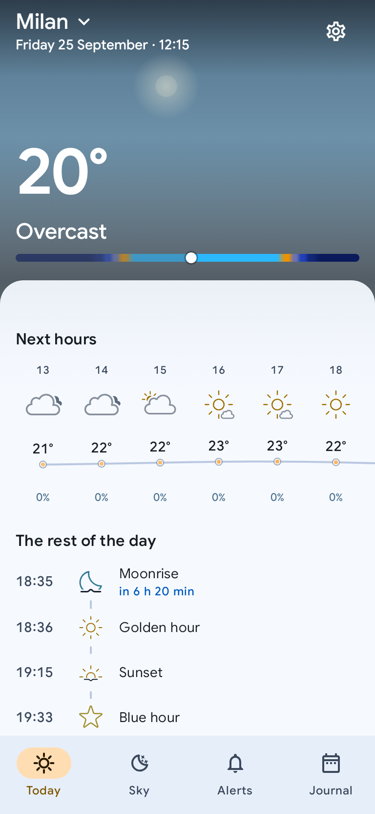<br><sub><b>Today</b>: the sky, then the numbers</sub></td>
    <td align="center" width="33%">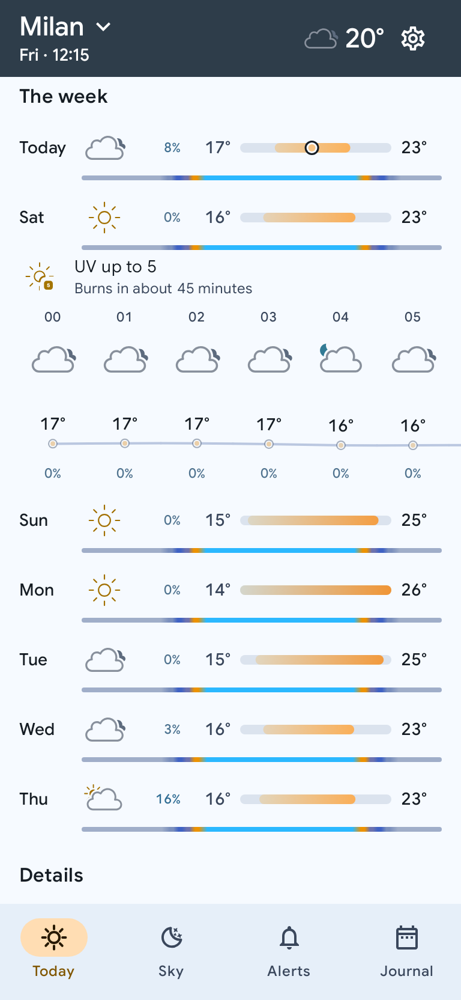<br><sub><b>The week</b>, on one temperature scale</sub></td>
    <td align="center" width="33%">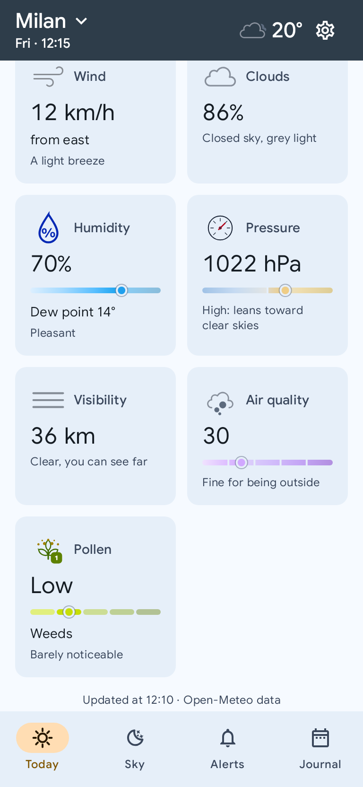<br><sub><b>Details</b>: every number with its meaning</sub></td>
  </tr>
  <tr>
    <td align="center">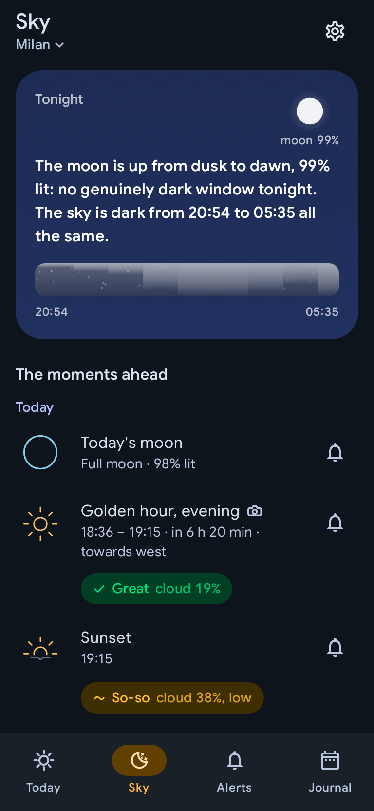<br><sub><b>Sky</b>: tonight, and the moments ahead</sub></td>
    <td align="center">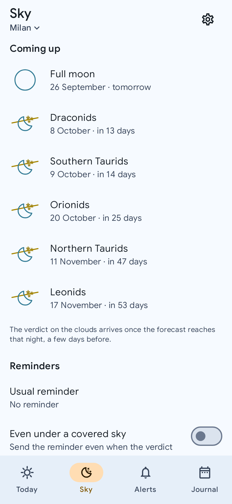<br><sub><b>The calendar ahead</b>, honestly dated</sub></td>
    <td align="center">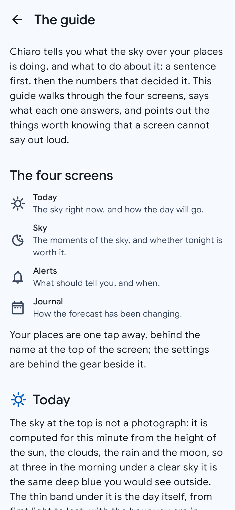<br><sub><b>The guide</b>, in the app</sub></td>
  </tr>
  <tr>
    <td align="center">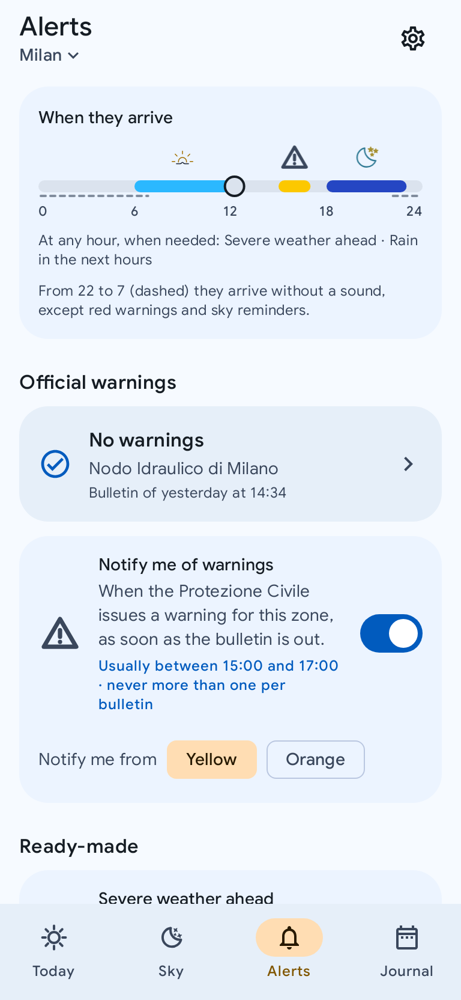<br><sub><b>Alerts</b> and the official bulletin</sub></td>
    <td align="center">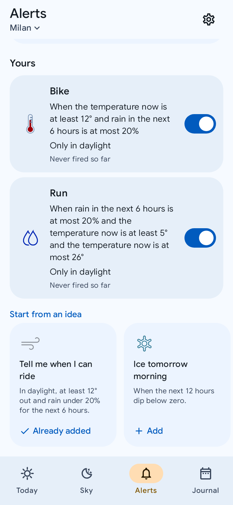<br><sub><b>Your own alerts</b>, written as sentences</sub></td>
    <td align="center">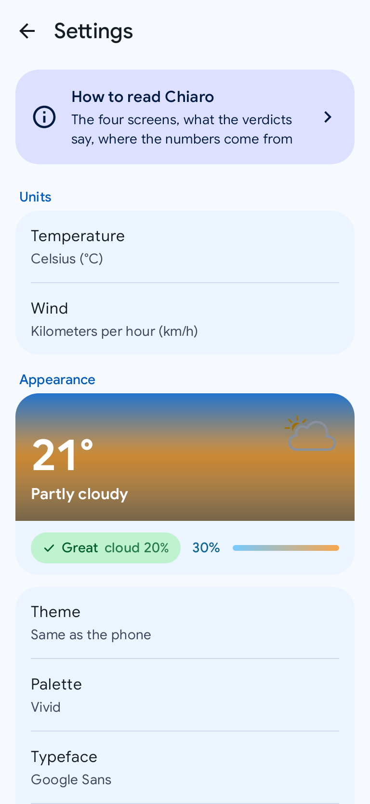<br><sub><b>Appearance</b>, with a live preview</sub></td>
  </tr>
  <tr>
    <td align="center">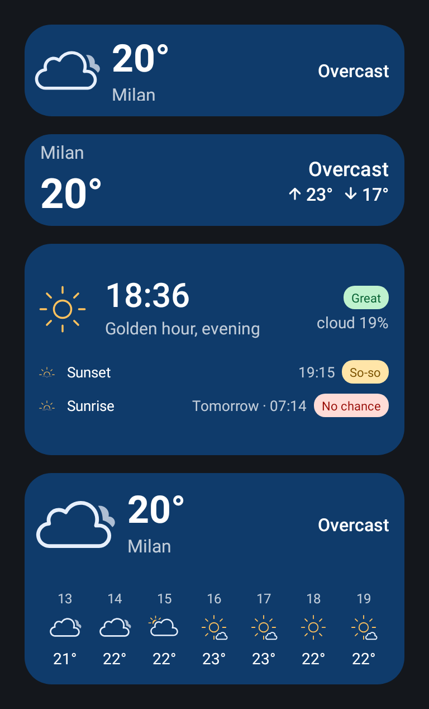<br><sub><b>Widgets</b>: Now, In words, Sky, Today</sub></td>
    <td align="center">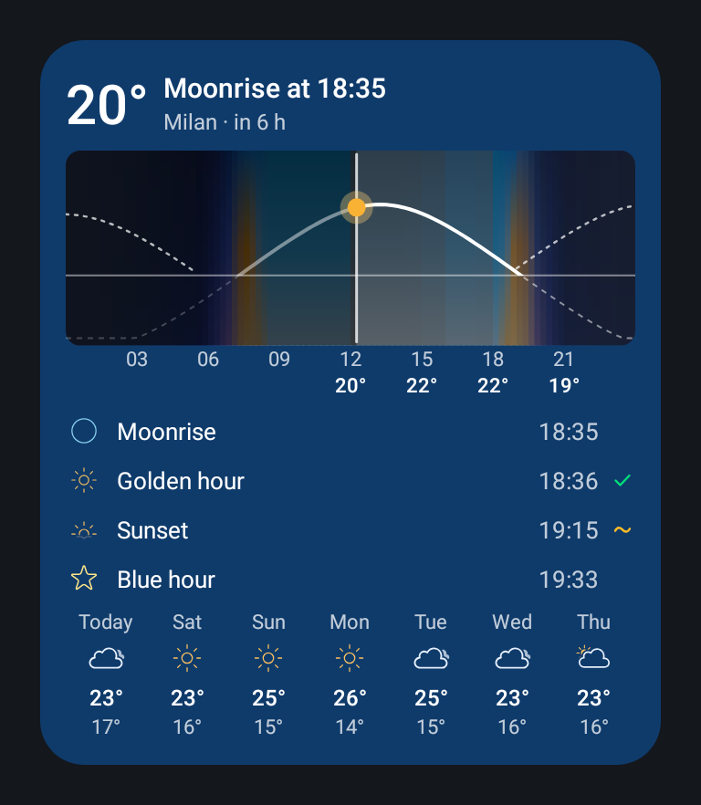<br><sub><b>The day's arc</b>: the sun's real path</sub></td>
    <td align="center">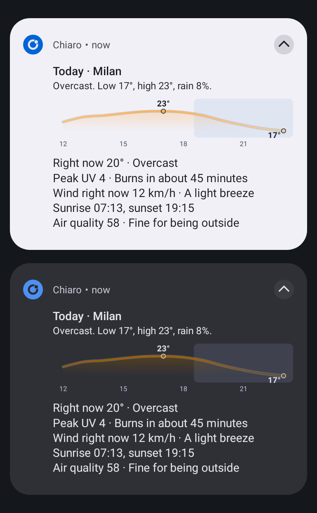<br><sub><b>The morning summary</b>, opened</sub></td>
  </tr>
</table>

Drawn by the app's own screens from real data for Milan (a recorded Open-Meteo forecast and
Protezione Civile bulletin), in English (the app also speaks Italian). The phone's status bar
and the launcher are not in the pictures. The Journal is not shown: its picture waits for days
of real forecast history. The command that redraws them is in [Build](#build).

## Features

- 🌤️ **Today**: a sky computed from the sun, the clouds and the moon, and one sentence on what is coming.
- 🕐 **The next hours**: temperature as a curve, chance of rain, and the rest of the day as one timeline.
- 📅 **The week**: seven days on one temperature scale, each with its ribbon of light. Open a day for its hours.
- 🔢 **Details**: UV, wind, clouds, air quality, pollen, each with the line that says what to do with it.
- 🌅 **Sky**: tonight's verdict, the moments ahead and a catalog of 60, all computed on the phone.
- 🔔 **Sky reminders**: a bell on any moment, quiet when clouds will hide it.
- 🇮🇹 **Official warnings**: the Protezione Civile bulletin, located by where a place is, offline too.
- ⚠️ **Alerts**: four ready-made switches, plus your own rules written as sentences, with the hours they may ring in.
- 📓 **Journal**: how the forecast changed, and how well it did on the days already over.
- 📍 **Places**: saved places side by side, search as you type, optional coarse location.
- 🏠 **Five widgets**: Now, Today, In words, Sky and the day's arc, each configured on its own.
- 📖 **The guide**: what each screen answers, and what a screen cannot say out loud.
- 🎨 **Appearance**: two palettes, three typefaces, two icon families, light or dark.
- 📴 **Offline, honestly**: the last report is always there, with its real age.
- 🇮🇹 🇬🇧 **Italian and English**, through the system per-app language picker.

## Principles

| | |
|---|---|
| 🖥️ **The screen must not lie** | a section with no data is not drawn. Stale data states its age, estimates say so |
| 💬 **One sentence before any number** | the top of Today is a computed line; the numbers follow |
| 🔢 **Every number says what to do with it** | a value plus its consequence, or it lives one tap deeper |
| 📴 **Offline-first** | the cached report renders before the network is asked; the astronomy never needs one |
| 🔒 **Privacy-first** | no account, no analytics, no crash reporting. Coarse location only, optional, never in the background. Only the place you ask about goes to Open-Meteo |
| 🔋 **Battery is a feature** | one shared periodic job, inexact alarms, no foreground service, no push service |

## The data

[Open-Meteo](https://open-meteo.com/): free, **no API key, no account**.

| What | Source |
|---|---|
| Current conditions, hourly, daily | Open-Meteo Forecast API |
| Air quality, pollen *(Europe only)* | Open-Meteo Air Quality API |
| Place search | Open-Meteo Geocoding API |
| Official warnings *(Italy only)* | Dipartimento della Protezione Civile |
| Sun, moon, twilight, meteor peaks, the verdicts | computed on the device, offline |

The icon and the word of each hour are Chiaro's own reading of the forecast's physical fields
(amounts, probability, temperature, visibility, clouds); the numbers on screen are always the
model's.

## Install

Android 13 (API 33) or newer.

1. Download `chiaro-vX.Y.Z.apk` from the [latest release](https://github.com/fiorenzobrioni/chiaro/releases/latest).
2. Open it on the phone and allow installs from that source when Android asks.
3. On the first run, use your position or search for a place.

**Verify the download.** Put the APK and its `.sha256` file in one folder and run
`sha256sum -c chiaro-vX.Y.Z.apk.sha256`. To check that the APK is genuine, compare its signing
certificate (`apksigner verify --print-certs`, or AppVerifier on the phone) with this SHA-256
fingerprint:

```
7B:05:E2:47:E4:22:F9:1F:E7:BD:FA:C9:E6:3E:72:2C:BB:6A:3A:7E:8D:43:56:36:66:53:6A:DA:75:8E:7B:22
```

**Updates.** Chiaro does not check for updates itself. Use GitHub's "Watch, Custom, Releases"
notifications, or [Obtainium](https://github.com/ImranR98/Obtainium). Every release installs
over the previous one and keeps your places, alerts and settings. The notes of each version
are in [CHANGELOG.md](./CHANGELOG.md).

## Roadmap

- **MeteoAlarm** for the rest of Europe, behind the same warning model; the Protezione Civile
  keeps precedence in Italy.

Out of scope on purpose: radar and satellite imagery, tides, aurora, Wear OS, a second
provider. The phased plan, with every decision and its reason, is in [PLANNING.md](./PLANNING.md).

## Build

Requires JDK 21. No signing setup, no API key, no local properties: clone and build.

```bash
./gradlew :app:assembleDebug          # app/build/outputs/apk/debug/app-debug.apk
./gradlew test :app:testDebugUnitTest # every module's tests
./gradlew :app:lintDebug              # lint
```

For an installable minified build to test with:
`./gradlew :app:assembleRelease -PsignReleaseWithDebugKey`. It is signed with the debug key
committed in `keystore/`, on purpose, so builds from CI and any machine share one signature.
Debug builds carry `applicationIdSuffix ".debug"` and install side by side with the release.

CI runs the tests and lint **before** building the APKs, so a red suite never produces an
installable artifact. A `vX.Y.Z` tag runs the same gates, then publishes the signed APK, its
checksum and the R8 mapping, with the matching [CHANGELOG.md](./CHANGELOG.md) section as the
release notes.

README screenshots:
`./gradlew :app:testDebugUnitTest --tests "*ReadmeScreenshots" -PupdateScreenshots`.

## Tech stack

- **Kotlin** 2.2, **Jetpack Compose** with Material 3, Gradle 9.1 and AGP 8.13, minSdk **33**
  (Android 13), target and compile SDK **36**
- **Retrofit**, **OkHttp** and **kotlinx.serialization** (Open-Meteo), **Room** (the update
  history), **DataStore** (settings, places, rules), **WorkManager** (the one periodic job),
  **Glance** (the widgets)
- **Coroutines** and **Flow**, a hand-rolled `ServiceLocator` instead of a DI framework,
  **Navigation 3**, and charts drawn on a Compose canvas rather than by a charting library
- **Meteocons** v3 as vector drawables, imported by a script, never drawn by hand
- Unit tests on the JVM for every engine (alerts, rules, astronomy, weather states), with
  Robolectric where Android is unavoidable; the design rules (no raw colours, measured
  contrast) are tests too

```text
Compose UI → ViewModel → :core:data (repository, stores) → Open-Meteo, Room, DataStore
                      ↘ :core:domain (pure engines: states, alerts, rules, astronomy)
```

## Project structure

```text
chiaro/
├── app/                    # everything visible
│   └── src/main/kotlin/com/callbackdev/chiaro/
│       ├── notifications/  # alert, rule and sky notifiers; the reminder alarms
│       ├── widget/         # Glance: Now, Today, In words, Sky, the day's arc
│       └── ui/             # theme, components, shell and one package per screen
├── core/
│   ├── domain/             # pure Kotlin: states, alerts, rules, astronomy, the weather model
│   ├── data/               # Open-Meteo client, mapper, Room, DataStore
│   └── sync/               # the one periodic job
├── tools/                  # icon import, palette generators, README data recorder
├── licenses/               # what ships inside the APK and is not ours
└── keystore/               # the shared debug key (deliberately committed)
```

`:core:domain` is pure Kotlin: a class in it that needs a `Context` is in the wrong module.

## Project documentation

| File | Contents |
|---|---|
| [VISION.md](./VISION.md) | the product: positioning, identity, every screen, the roadmap, the open decisions |
| [DESIGN.md](./DESIGN.md) | the design system: colour, the sky canvas, type, motion, charts, accessibility, each value with its measured number |
| [PLANNING.md](./PLANNING.md) | the phased plan with checkable steps, and every decision with its reason |
| [UPSTREAM.md](./UPSTREAM.md) | history: where the engines came from, frozen since Chiaro became independent |
| [CHANGELOG.md](./CHANGELOG.md) | what shipped, per version; a section is written before its tag |
| [CLAUDE.md](./CLAUDE.md) | the operating rules for AI-assisted development in this repo |

## The family

Chiaro is one of three focused apps with the same look and the same rules:
[Passo](https://github.com/fiorenzobrioni/passo) (steps) and
[Saldo](https://github.com/fiorenzobrioni/saldo) (personal finance).

## License

[GPL-3.0](./LICENSE) © 2026 Fiorenzo Brioni

Weather data by [Open-Meteo](https://open-meteo.com/) (CC BY 4.0); warning zones by the
Dipartimento della Protezione Civile (CC BY 4.0).
[Google Sans](https://fonts.google.com/specimen/Google+Sans) and
[Inter](https://github.com/rsms/inter) under the SIL Open Font License 1.1,
[Meteocons](https://github.com/basmilius/meteocons) under MIT. Full attributions in
[licenses/](./licenses/).
